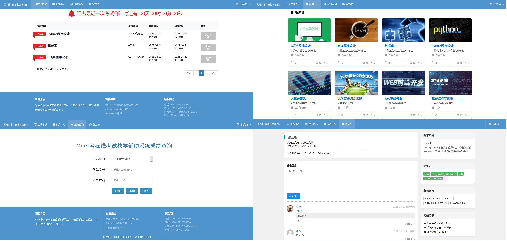
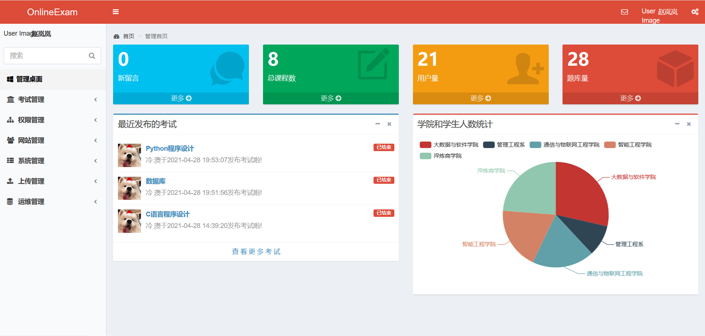
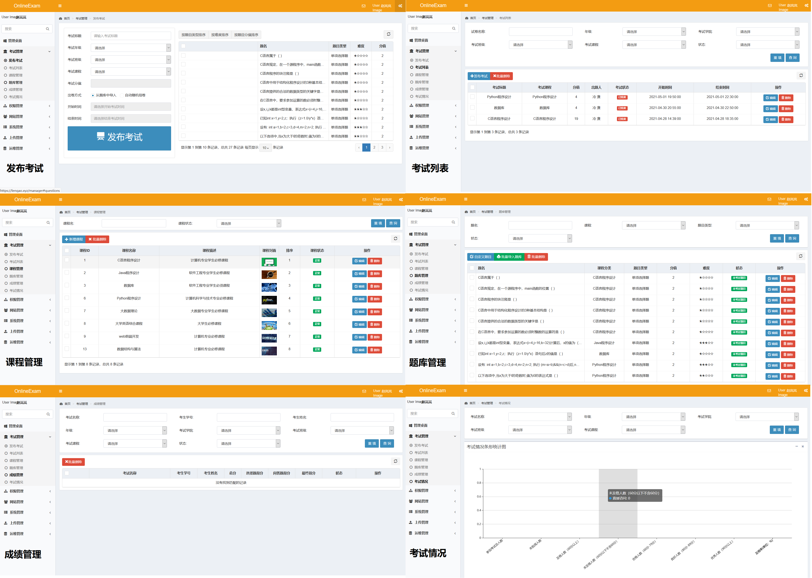
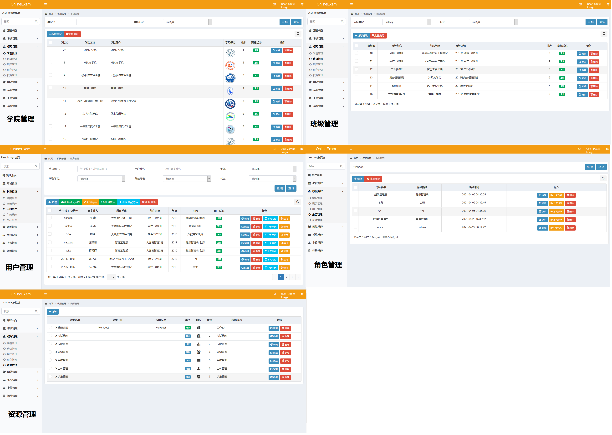
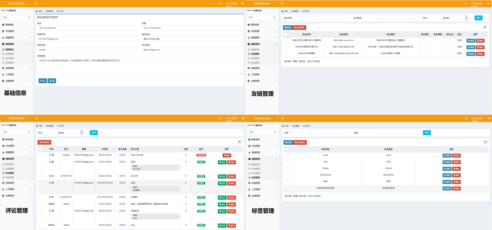
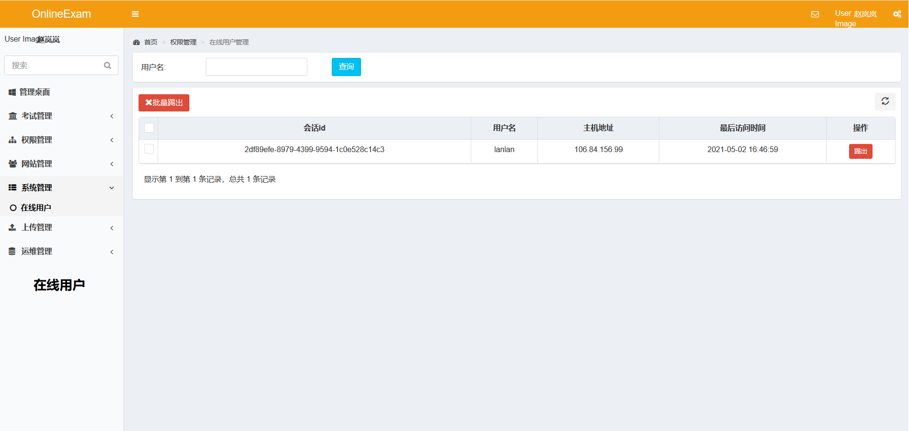
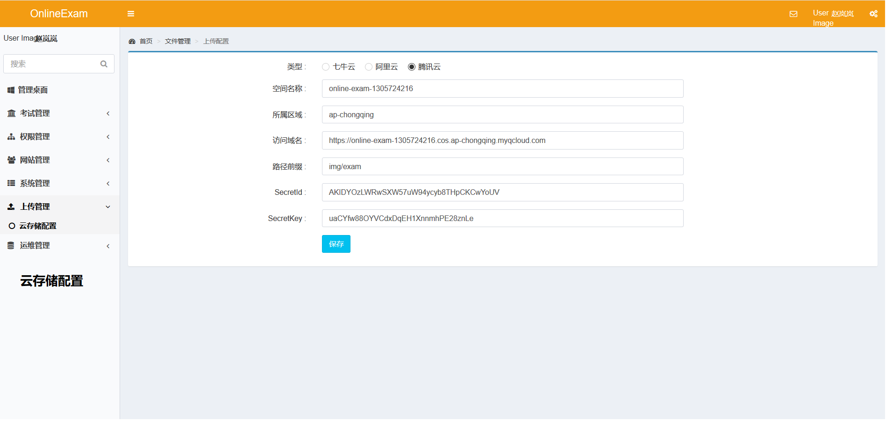
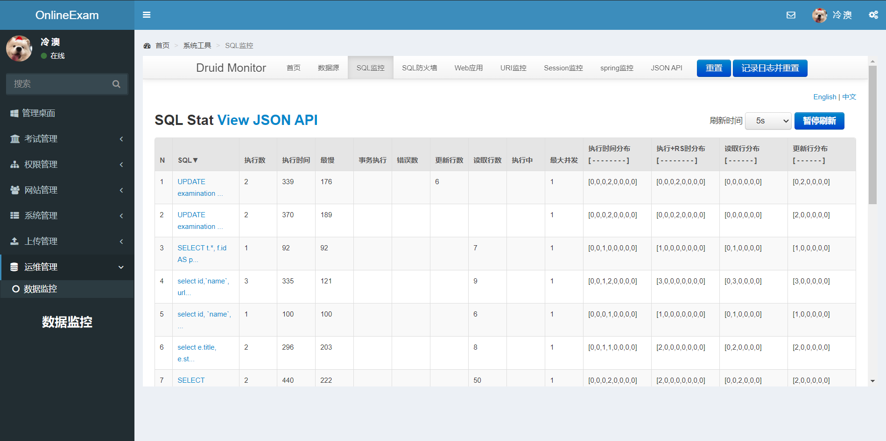

#基本信息

## 项目介绍
Quer考是一款多角色在线考试教学辅助系统，具备相对完善的功能。

## 技术选型

    核心框架：Spring Boot 2.0、Shiro 1.4
    
    视图框架：Spring MVC 5.2、Thymeleaf 3.0
    
    持久层框架：Apache MyBatis 3.5、Alibaba Druid 1.1
    
    日志管理：SLF4J、Log4j
    
    前端组件：jQuery 3.4、HC-Sticky 2.1、jQuery easyfader
    
##展示效果

    一、网站主页面

    二、登录页面

    
    三、学生操作页面

    
    四、管理员主页面

    
    五、考试管理

    
    六、权限管理

    
    七、网站管理

    
    八、系统管理

    
    九、上传管理 

    
    十、运维管理 

## 安装教程

    创建数据库，导入sql语句后修改application.yml中MySQL与Redis的配置即可启动
    
    注意版本信息，此项目中使用的十MySQL8.0.x
  
## 存在问题
    目前项目还存在以下问题，以后有时间会修复：
    发现日期：2021.5.13
    1.进入考试时，如果用户不给摄像头权限，前端依旧会给服务器发送相机截图（黑屏）导致验证失败，直接提交考试。
    2.真正提交考试前，界面会提示“正在提交考试”2秒，相当于2秒延迟，此时利用浏览器返回上一界面可以终止提交
    （用户作弊，系统强制提交考试时，用户可以利用此BUG）
    3.oss对象存储上传失败问题，导致excel表格、用户头像等上传失败
    4.对在线用户踢出失败
    
    发现日期：2021.5.14
    1.评论点赞失败
    2.查询成绩失败
    3.无法批阅试卷
    
